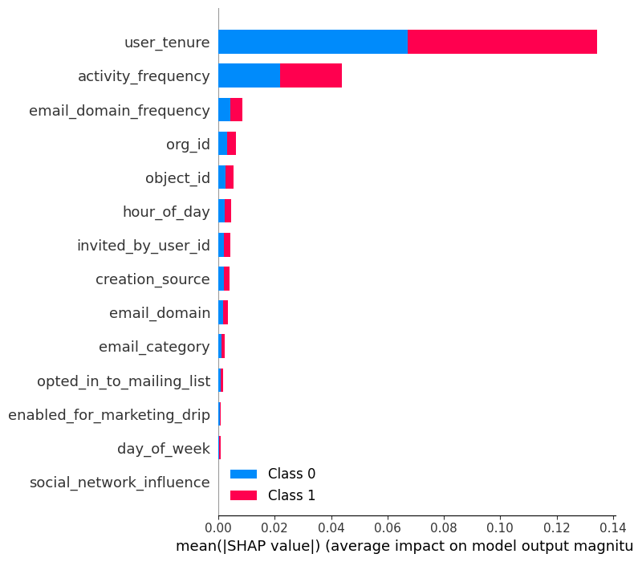
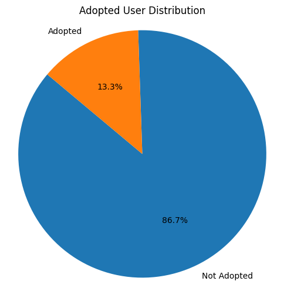
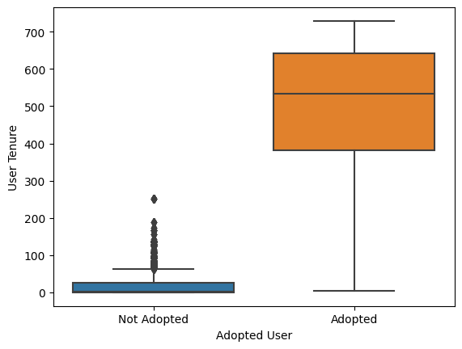

# User Adoption Analysis

## Business Problem
Understanding how various factors impact the likelihood of users becoming 'adopted users' within the application.

## Summary of the Exploration
Key factors influencing user adoption include:
- User tenure
- Activity frequency
- Email domain frequency
- Organizational affiliation (org_id)

Distinctions between adopted and non-adopted users are unclear for email_domain_frequency and org_id. Further refinement through hyperparameter fine-tuning and advanced feature engineering is necessary. In simple terms, user longevity, frequent app use, and engagement matter most. Surprisingly, organizational affiliation (org_id) isn't a major standalone factor. Only 13.3% of users meet the 'adopted user' criteria, potentially due to some difficulty or low overall user activity. More investigation into user behavior is needed for clearer insights or easier criteria attainment.

## Preprocessing Steps Taken
1. **Datetime Conversion:**
   - The 'time_stamp' column was converted into datetime format for time-based analysis, allowing for better understanding of user behavior patterns over time.

2. **Categorical to Numerical Conversion:**
   - Categorical features were transformed into numerical format using label encoder. These steps are essential for data preparation before analysis. Converting the timestamp enables time-based analysis, while encoding categorical features ensures compatibility with machine learning models that operate on numerical data.

## Feature Engineering Steps Taken
1. **Email Domain Analysis:**
   - Captures email domain frequencies and categorizes popular providers for user demographic insights.
   
2. **Activity Frequency:**
   - Measures time gaps between user actions, indicating engagement regularity.
   
3. **Unique Interaction Days:**
   - Counts days of user interaction, distinguishing consistent from sporadic engagement.
   
4. **User Engagement Level:**
   - Calculates engagement intensity based on recent visits relative to overall interaction days.
   
5. **Temporal Patterns:**
   - Identifies trends by analyzing time-based user activity.
   
6. **User Tenure:**
   - Calculates duration of user engagement from creation to last session.
   
7. **Social Network Influence:**
   - Assesses user influence based on invitations extended to others.

These engineered features aim to uncover various facets of user behavior and engagement, aiding in understanding user adoption patterns and interaction trends.

## Model Selection
Random Forest Classifier and XGBoost for Feature Importance:
- RandomForestClassifier and XGBoost models employed to compute feature importance.
- RandomForestClassifier uses the `feature_importances_` attribute to rank features by their contribution to model performance.
- XGBoost, a boosting algorithm, offers insights into feature importance, enabling a thorough assessment of influential features.
Utilizing both models enhances the understanding of feature significance, guiding the selection of key variables for improved model efficiency and performance.

## Conclusion
Only 13.3% of all users fit the 'adopted user' definition, which might mean it's hard to meet the criteria—logging in three times in a week—or that users aren't very active. Looking closer at how users behave could help us make it easier for more users to meet this criteria or understand why only a small group does. When we looked at what makes users stick around, we found that how long someone has been using the app really matters—they're more likely to keep using it. Other important things include how often they use the app, their email type, and how much they interact with it. Interestingly, where they fit in the organization (org_id) doesn't seem to play a big role by itself in whether they become a regular user.

   

